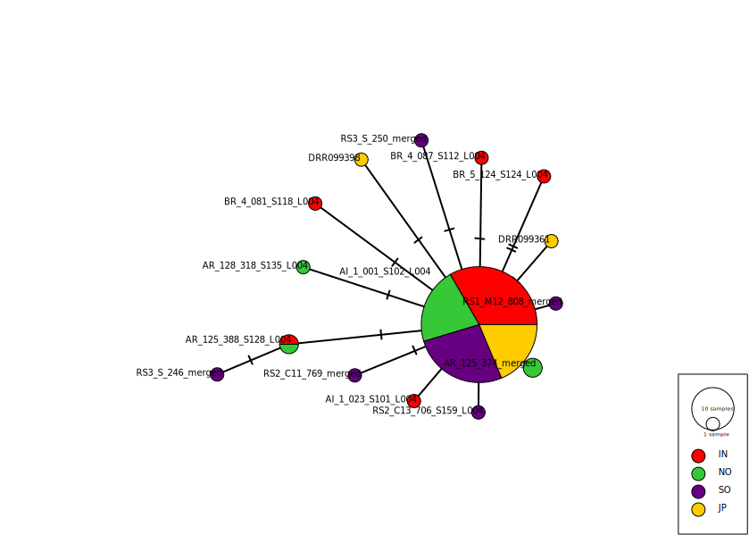

Host Mitogenomes
================

# Host mitochondrial genotyping

We obtained mitochondrial sequences for individual low coverage samples
as follows;

-   All reads (except duplicates) for each sample were mapped to the A.
    digitifera mitochondrial reference sequence (NC\_022830.1) using bwa
    mem (version 0.7.17). This produced a small bam file containing only
    mito reads for each sample. See the script
    [02\_map\_reads.sh](data/hpc/mito_mapping/02_map_reads.sh) for the
    exact commands used.  
-   Mitochondrial reads were then used to call variants against the
    reference sequence using samtools mpileup (version 1.7), followed by
    bcftools (version 1.9) to call a consensus sequence for the sample.
    (See script
    [data/hpc/mito\_mapping/03\_call\_consensus.sh](03_call_consensus.sh))
-   Since consensus sequences were all the same length no alignment was
    necessary and they were simply concatenated to produce an alignment.
-   This set of aligned mitochondrial sequences was used as a set of
    haplotypes for network visualisation with
    [PopArt](http://popart.otago.ac.nz/index.shtml)

The resulting haplotype network is shown below. Note how the vast
majority of samples share a haplotype and how those haplotypes that
differ are (a) spread among locations and (b) mostly attributable to a
single mutation from the common haplotype.

