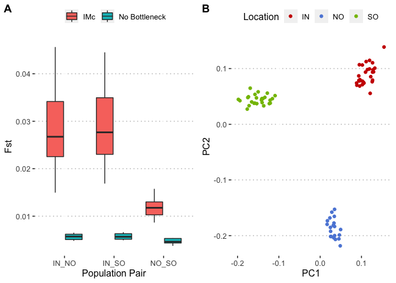

Simulated data under a model without a bottleneck
================

Analyses with SMC++ and fastsimcoal both indicated the presence of a
strong bottleneck (most likely founder effect) in all three populations.
These bottleneck effects would have contributed to drift, which,
combined with low migration rates would have resulted in the clear
divergence observed in population structure analyses. Here we used
fastsimcoal analyses to disentangle these effects. To do this we
constructed a model (called `no_bott`) that was based on the best
fitting model, but, where all changes in Ne were removed, effectively
keeping the population size the same as the ancestral population with
subdivision on splits. This model is detailed in
[3.out.no\_bott.est](data/hpc/fastsimcoal/no_bott/3.out.no_bott.est) and
[3.out.no\_bott.tpl](data/hpc/fastsimcoal/no_bott/3.out.no_bott.tpl)

Simulations with this model were generated using

``` bash
fsc2705 -t 3.out.no_bott.tpl -n 1 -e 3.out.no_bott.est  -E 10 -G x -c 0 -k 10000000
```

After converting to `vcf` they were used to calculate genome-wide Fst
values between all pairs with plink2. This was done separately for each
independent simulation.

``` bash
plink2 --vcf ${f} --fst site --pheno phenotypes.txt --allow-extra-chr --out fst/${s2}_no_bott.fst
```

The boxplot below shows that these Fst values are much smaller than
those for the full model (`IMc`) that includes population size changes.
Thus indicating a strong contribution from the bottleneck to drift and
population divergence.

<!-- -->
