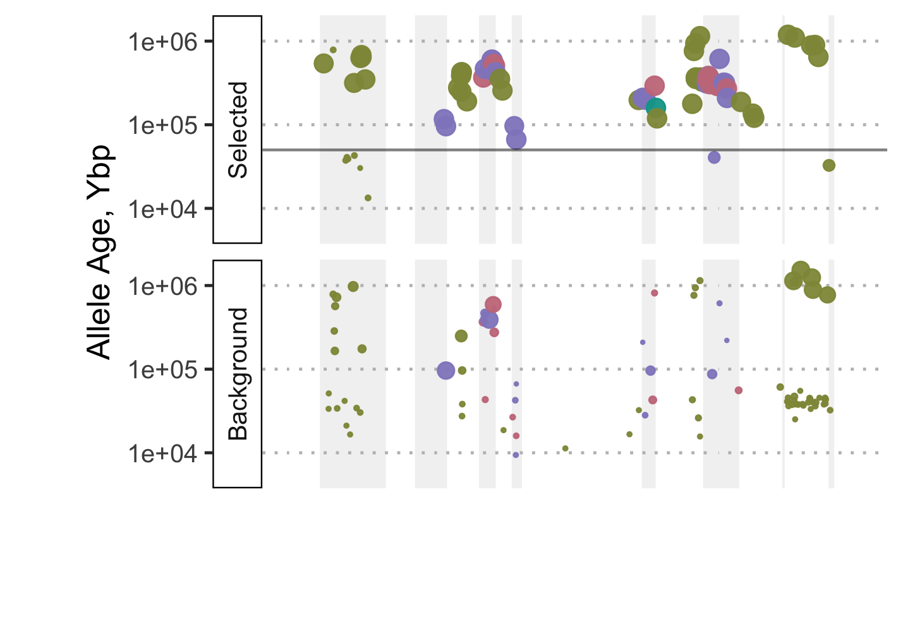

```{r setup, include=FALSE, message=FALSE}
knitr::opts_chunk$set(echo = FALSE,message=FALSE,warning = FALSE)
library(tidyverse)
library(ggpubr)
library(cowplot)
```

To investigate the timing of selection in relation to the emergence of variants at selective sweeps we used [GEVA](https://github.com/pkalbers/geva) [@Albers2020-vl] (Genealogical Estimation of Variant Age) to estimate the age of variants at selected loci. 

One requirement for GEVA is that the ancestral and derived alleles are identified for each SNP. We used [est-sfs](http://www.homepages.ed.ac.uk/pkeightl//software) [@Keightley2018-dh] for this task as follows;
  
First we created a whole-genome alignment of *A. digitifera* with two outgroup species, *A. millepora* and *A. tenuis* using [Cactus](https://github.com/ComparativeGenomicsToolkit/cactus) (v2.0.5). We then exported the alleles at all snps using `halSnps` and filtered these to only include those overlapping our SNP callset. These were then used to generate an input file for `est-sfs`. 

After running `est-sfs` we used `bcftools` and custom awk scripts to update our phased variant callset by assigning the ancestral allele inferred by `est-sfs` to the reference allele.  This updating process takes care to update genotypes in instances where ref and alt alleles are swapped from their original values.  See bash and shell scripts in [data/hpc/ancestral_allele/](data/hpc/ancestral_allele/) for details.

The phased vcf file with ref updated to the ancestral allele was then used as input to GEVA. See [data/hpc/geva/](data/hpc/geva/) for details

## Variant consequence calling

We used `bcftools csq` to predict variance consequences for all SNPs overlapping the haem peroxidase gene `s0150.g24`.  Since we are interested in the consequences of derived alleles we first created a version of the *A. digitifera* genome in which the bases were altered at all SNP positions to be that of the ancestral allele.

```bash
# This uses bcftools to identify ref mismatches in the vcf with aa=ref
bcftools norm -c=w BLFC01000154.1_aaref.vcf.gz -f BLFC01000154.1.fasta 2> ref_mismatches.txt

# This creates a version of the ref with ancestral allele at SNP positions
cat ref_mismatches.txt | awk -f aaref.awk | bioawk -c fastx '{printf(">%s\n%s\n",$name,$seq)}' > BLFC01000154.1_aa.fasta

# Check that the new ref is correct
bcftools norm -c=x BLFC01000154.1_aaref.vcf.gz -f BLFC01000154.1_new.fasta
```

Consequence calling was then done using the vcf and reference sequences where the AA is encoded as REF.

```bash
bcftools csq -f BLFC01000154.1_aa.fasta -g s0150.g24.gff BLFC01000154.1_aaref.vcf.gz -O t > s0150.g24.csq.tsv 
```


## Haem Peroxidase locus on BLFC01000154.1

We used results from GEVA in combination with allele frequency and variant consequence information to investigate variants overlapping `s0150.g24` in detail.  
A plot of these allele frequencies by population indicates a large number of high-frequency derived alleles in the inshore population compared with the two offshore populations. This is expected since the inshore population was under selection.  Interestingly, when we break this down further we see that low frequency alleles in the inshore population are far younger than high frequency ones with the switch occurring between 2000 and 10000 generations ago. This strong dichotomy between young, rare alleles and old frequent ones is not present in the reference (offshore) populations. It suggests that most rare alleles in the inshore population reflect variants that have arisen since the onset of strong selection at this locus.

```{r}
if ( !file.exists("data/r_essentials/geva_pos.rds")){

  # Read allele age info from GEVA and join with physical position info
  sites_files <- list.files("data/hpc/geva/chroms/BLFC01000154.1/","*.sites2.txt",full.names = TRUE)

  options(readr.show_col_types = FALSE)
  geva_sites <- map_dfr(sites_files,read_table, col_types=cols())

  markers <- read_table("data/hpc/geva/chroms/BLFC01000154.1/BLFC01000154.1_geva.marker.txt")

  geva_pos <- geva_sites %>% 
    left_join(markers)
  write_rds(geva_pos,"data/r_essentials/geva_pos.rds")
  
  
#  pairs_files <- list.files("data/hpc/geva/chroms/BLFC01000154.1/","*.pairs.txt",full.names = TRUE)
#  geva_pairs <- map_dfr(pairs_files,read_table, col_types=cols())
  
} else {
  geva_pos <- read_rds("data/r_essentials/geva_pos.rds")
}

# Read haplotype-aware consequence info and join with geva_info
#
csq <- read_tsv("data/hpc/vcsq/s0150.g24.csq.tsv",col_names = c("CSQ","Sample","Hap","Chr","Position","Consequence"),skip = 4)

in_exclude_haps <- c("BR_5_121_S125_L004_1","BR_5_121_S125_L004_2","BR_5_123_S121_L004_1")

csq_pos <- csq %>% 
  left_join(geva_pos,by="Position") %>% 
  unite("Haplotype",Sample,Hap,sep = "_",remove = FALSE) %>% 
  extract(Consequence,into = "Category","([^\\|]*)",remove = FALSE) %>% 
  extract(Haplotype,into = "Location","([^_]*)",remove = FALSE) %>% 
  mutate(Category = case_when(
    Category=="intron" ~ "Non Coding",
    Category=="missense" ~ "Missense",
    Category=="splice_region" ~ "Splice Region",
    Category=="synonymous" ~ "Synonymous"
    )) %>% 
  ungroup() %>% 
  group_by(Position) %>% 
  mutate(total_haps=n_distinct(Haplotype)) 
```

Combining all this information we create the plot below

```{r}
n_inshore_haps <- 57
n_offshore_haps <- 91
sweep_age <- 8269.349

g24 <- read_tsv("data/hpc/vcsq/s0150.g24.mod.gff",col_names = c("Chr","Prog","feature_type","start","end")) 
  
g24_ex <- g24 %>% filter(feature_type=="exon")
g24_gene <- g24 %>% filter(feature_type=="gene")
g24_cds <- g24 %>% filter(feature_type=="CDS")


hap_based_af <- csq_pos %>% 
  ungroup() %>% 
  filter(between(Position,g24_gene$start,g24_gene$end)) %>% 
  filter(Clock=="J") %>% 
  # Mostly we can distinguish selected vs background on the basis of location, however three haplotypes (below) need manual fixing for this
  # BR_5_121 is mislabelled so we need to set its status to background and BR_5_123 has a haplotype from inshore that clusters with the selected clade
  mutate(selection_status = ifelse( (!(Haplotype %in% c("BR_5_121_S125_L004_1","BR_5_121_S125_L004_2","BR_5_123_S121_L004_1")) & (Location %in% c("BR","AI"))),"Selected","Background")) %>% 
  group_by(Position,Category,PostMode) %>% 
  summarise(
    Selected = sum(selection_status=="Selected")/n_inshore_haps, 
    Background = sum(selection_status=="Background")/n_offshore_haps,
    Total = n()/148,
    N_Concordant,
    N_Discordant,
    Age = PostMode*5
    ) %>% 
  mutate(age_class = cut(Age,breaks=c(0,15000,Inf))) %>% 
  pivot_longer(cols=c("Selected","Background"), names_to = "haptype",values_to = "Freq") %>% 
  mutate(freq_class = cut(Freq,breaks=c(0,0.25,0.5,0.75,1.0))) %>% 
  distinct()

p_all <-  hap_based_af %>% 
    filter(Freq>0) %>% 
  filter(Total<1) %>%
  ggplot() + 
  geom_violin(aes(x=haptype,y=Freq,fill=haptype,color=haptype)) 

p_ac <- hap_based_af %>% 
  filter(Freq>0) %>% 
  filter(Total<1) %>%
    ggplot() + 
  geom_violin(aes(x=haptype,y=Freq,fill=haptype,color=haptype)) + 
  facet_wrap(~age_class, nrow=1)

#plot_grid(p_all,p_ac,ncol=1, labels = c("A","B"))
```

```{r}
hap_based_af %>% 
  filter(Freq>0) %>% 
  filter(Total<1) %>%
  ggplot() + 
  geom_violin(aes(x=haptype,y=Freq,fill=haptype,color=haptype)) + 
  facet_wrap(~age_class, nrow=1) + 
  theme_pubclean() + guides(fill="none",color="none") + 
  xlab("") + ylab("Allele Frequency")
ggsave("figures/fig-s20.png", width = 6.5,height = 4)
```

As a quality check on the GEVA estimates we examine the number of concordant and discordant pairs available for each allele.  We found that in general all alleles had sufficient Discordant pairs, however for low frequency alleles the number of concordant pairs was often quite low, sometimes as low as 1.  GEVA did not produce age estimates for alleles with no concordant pairs (ie present on a single haplotype).  In general, alleles with few concordant pairs and low frequency were also young, however among background haplotypes we found many alleles at low frequency that were also old. 

```{r}
hap_based_af %>% 
  filter(Freq>0) %>% 
  filter(Total<1) %>% # Remove if monomorphic across all haps (ie a Japan-only polymorphism)
  ggplot(aes(x=PostMode*5,y=N_Concordant)) + 
  scale_x_log10() +
  geom_point(aes(color=Freq)) + 
  scale_color_viridis_c() +
  geom_vline(xintercept=1.5e4) +
  facet_wrap(~haptype) 
```


```{r}
hap_based_af %>% 
  ungroup() %>% 
  dplyr::group_by(age_class,haptype) %>% 
  dplyr::summarise(count=n())
```


```{r, include=FALSE}
library(colorspace)
cat_colors <- qualitative_hcl(4, palette = "Dark 2")
names(cat_colors) <- c("Missense","Non Coding","Splice Region","Synonymous")

simple_cat_colors <- c(cat_colors["Missense"],cat_colors["Splice Region"],"Other"="Black")

csq_plot_data <- csq_pos %>% 
  filter(Clock=="J") %>% 
  group_by(Position) %>% 
  mutate(total_haps = n_distinct(Haplotype)) %>% 
  ungroup() %>% 
  mutate(selection_status = ifelse( (!(Haplotype %in% c("BR_5_121_S125_L004_1","BR_5_121_S125_L004_2","BR_5_123_S121_L004_1")) & (Location %in% c("BR","AI"))),"Selected","Background")) %>%
  mutate(selection_status_order = ifelse(selection_status=="Selected",1,2)) %>% 
  group_by(Position,selection_status) %>% 
  dplyr::summarise(Category,PostMode,selection_status_order,total_haps,hap_count = n_distinct(Haplotype)) %>% 
  mutate(hap_freq = ifelse( selection_status=="Selected", hap_count/n_inshore_haps,hap_count/n_offshore_haps)) %>% 
  distinct() %>% 
  filter(total_haps<=140) %>% # Remove SNPs that are nearly monomorphic (derived AF>95%) because these don't differentiate between populations. 
  filter(hap_freq>0) 

simple_csq_plot_data <- csq_plot_data %>% 
  mutate(Category = case_when(
    Category %in% c("Synonymous","Non Coding") ~ "Other",
    TRUE ~ Category
  )) 

g24_poly <- g24_ex %>% 
  mutate(exon_num=row_number()) %>%
  mutate(x1=start) %>%  
  mutate(x2=end) %>% 
  mutate(x3=end) %>% 
  mutate(x4=start) %>% 
  select(exon_num,x1,x2,x3,x4) %>% 
  pivot_longer(starts_with("x"),values_to = "x") %>% 
  mutate(y = case_when(
    name %in% c("x1","x2") ~ 3e3,
    TRUE ~ 5e5
  ))

p_snps <- simple_csq_plot_data %>% 
  ggplot() + scale_y_log10(limits=c(2.8e3,5e5), breaks = c(1e4,1e5), labels = c("10","100")) +
  geom_polygon(data=g24_poly,aes(x=x,y=y,group=exon_num), fill="grey", alpha = 0.2) +
  geom_linerange(data=simple_csq_plot_data %>% filter(Category!="Other"), aes(xmin=Position-20,xmax=Position+20,y=2.8e3,color=Category),size=2) +
  geom_point(data = simple_csq_plot_data %>% filter(Category=="Other"),
             aes(y=PostMode*5,x=Position,fill=hap_freq),shape=21) +
  geom_point(data = simple_csq_plot_data %>% filter(Category!="Other") ,
             aes(y=PostMode*5,x=Position,fill=hap_freq,color=Category),shape=21) +  
  facet_wrap(~reorder(selection_status,selection_status_order),ncol = 1,strip.position = "left") +
  scale_color_manual("Variant Effect",values=simple_cat_colors[1:2]) + #, breaks = simple_cat_colors[1:2]) +
  scale_fill_viridis_c("Frequency") +
#  scale_size_area("Frequency",max_size = 1) +
  theme_pubclean() + 
  theme(legend.position = "bottom") + 
  theme(strip.background = element_rect(fill = "transparent",color="black"), 
        text = element_text(size=10), 
        axis.text.x = element_blank(), 
        axis.ticks.x = element_blank(),
      #  legend.title = element_blank()
#        axis.text.y = element_blank(),
#        axis.title.x = element_text(size=12),
#        strip.text = element_text(size=12)
#      base_size = 12) +
) +
    ylab("Allele Age, Kya") + 
  xlab("") + 
#  geom_hline(aes(yintercept=15000,alpha=selection_status),size=0.5,color="black") +
#  scale_alpha_manual(values=c(0,0.5)) + 
  guides(alpha="none") +
  xlim(275000,285000)

library(gggenes)
g24_sub <- g24 %>% 
  filter(feature_type %in% c("5'UTR","3'UTR", "CDS")) %>% 
  arrange(feature_type)


p_gene <- g24_gene %>% ggplot() +
  geom_gene_arrow(aes(y=Chr,xmin=start,xmax=end, forward = FALSE)) +
  geom_subgene_arrow(data=g24_sub,aes(xmin=275513,xmax=284565,xsubmin=start,xsubmax=end,y=Chr,fill=feature_type), forward=FALSE, alpha=0.9) +
    ylab("") + theme_genes() +
  xlim(275000,285000) + 
  theme(legend.position="none", 
        text = element_text(size=8), 
#        axis.text.x = element_text(size=14),
#        strip.text = element_text(size=12),
        legend.title = element_blank())

legend <- get_legend(
  # create some space to the left of the legend
  p_snps + theme(legend.box.margin = margin(0, 0, 0, 0)) +
    theme(legend.position = "bottom",legend.box.just="center")#, legend.key = element_blank())
)

pcol <- plot_grid(p_snps + theme(legend.position="none"),
                  p_gene ,
                  ncol=1,
                  align = "v",axis="lr",
                  rel_heights = c(0.85,0.15))

ggsave(pcol,filename = "figures/allele_age.pdf",width = 13,height = 8.6, units = "cm")

pcol <- plot_grid(p_snps + theme(legend.position="bottom"),
                  p_gene ,
                  ncol=1,
                  align = "v",axis="lr",
                  rel_heights = c(0.85,0.15))
plot_grid(pcol,legend,nrow = 1,rel_widths = c(0.85,0.15))
ggsave(legend,filename = "figures/allele_age_legend.pdf",width = 14,height = 1.5, units = "cm")
```

```{r}

```

An interesting feature of this plot is the very large number of missense variants in the second exon.  Let's count how many of these there are compared with the background

```{r}
csq_plot_data %>% filter(between(Position,282258,282894)) %>% group_by(selection_status,Category) %>% summarise(count=n_distinct(Position))
```


There are quite a few missense variants in the inshore copy. We can export the resulting protein sequence to see if there are any consequences of this change

```bash
bcftools view -S selected_indvs.txt BLFC01000154.1_aaref.vcf.gz > BLFC01000154.1_aaref_inshore.vcf
bgzip BLFC01000154.1_aaref_inshore.vcf 
tabix BLFC01000154.1_aaref_inshore.vcf.gz
bcftools consensus  -f BLFC01000154.1_aa.fasta BLFC01000154.1_aaref_inshore.vcf.gz > BLFC01000154.1_inshore_consensus.fasta
```

```bash
gffread -g BLFC01000154.1_inshore_consensus.fasta -y s0150.g24.protein_inshore.fa s0150.g24.gff
samtools faidx ../annotation/protein.fa adig_s0150.g24.t1 > s0150.g24.protein.fa 
```


