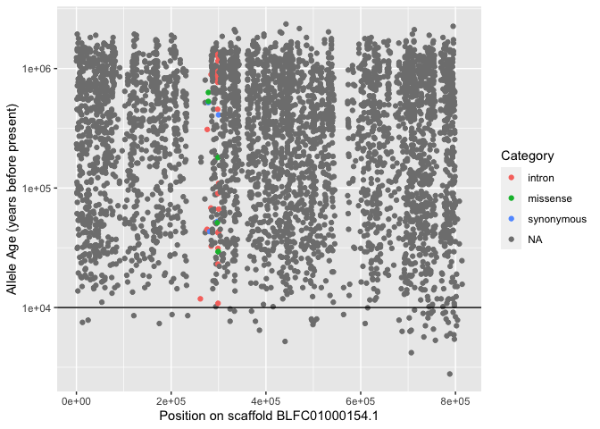
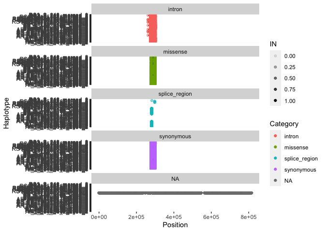

Dating allele emergence using GEVA
================

To investigate the timing of selection in relation to the emergence of
variants at selective sweeps we used
[GEVA](https://github.com/pkalbers/geva) (Albers and McVean 2020)
(Genealogical Estimation of Variant Age) to estimate the age of all 7.7M
variants genome-wide that were present within our sample of phased
haplotypes (see [03.phasing](03.phasing.md)).

One requirement for GEVA is that the ancestral and derived alleles are
identified for each SNP. We used
[est-sfs](http://www.homepages.ed.ac.uk/pkeightl//software)
(**Keightley2018-dh?**) for this task as follows;

First we created a whole-genome alignment of *A. digitifera* with two
outgroup species, *A. millepora* and *A. tenuis* using
[Cactus](https://github.com/ComparativeGenomicsToolkit/cactus) (v2.0.5).

``` bash
cactus jobstore seqfile.txt corals.hal
```

We then exported the alleles at all snps using `halSnps` and then
filtered these to only include those overlapping our callset

``` bash
halSnps corals.hal adig amil,aten --tsv snps.tsv
bcftools query ../vcf_file/Adigi.v2.filtered.vcf.gz -f "%CHROM\t%POS0\t%POS\t%REF\t%ALT{0}\t%AC\t%AN\n" > variants.bed
bedtools intersect \
    -a variants.bed \
    -b <(cat snps.tsv | grep -v '^ref' | sort -k1,1 -k2,2n  | awk 'NF==5{printf("%s\t%s\t%s\t%s,%s,%s\n",$1,$2,$2+1,$3,$4,$5,$6)}') \
    -loj -F 1 -f 1 > variants_snps.tsv
```

These were then used to generate an input file for `est-sfs` and to run
`est-sfs`

``` bash
cat variants_snps.tsv | awk -f snps2estsfs.awk > estsfs-input.txt
est-sfs config-rate6.txt estsfs-input.txt seedfile.txt output-file-sfs.txt output-file-pvalues.txt
```

We then used `bcftools` and custom awk scripts to update our phased
variant callset by assigning the ancestral allele inferred by `est-sfs`
to the reference allele. This updating process takes care to update
genotypes in instances where ref and alt alleles are swapped from their
original values.

``` bash
paste variants_snps.tsv <(tail -n+9 output-file-pvalues.txt) | awk -f estsfs2aa.awk > aa.tab
bgzip aa.tab
tabix -s1 -b2 -e2 aa.tab.gz -f
bcftools annotate -a aa.tab.gz -c CHROM,POS,INFO/AA \
    ../vcf_file/Adigi.v2.indv74_phased.vcf.gz -h aa.hdr > Adigi.v2.indv74_phased_aa.vcf
cat Adigi.v2.indv74_phased_aa.vcf | awk -f aa2ref.awk > Adigi.v2.indv74_phased_aaref.vcf
```

``` bash
plink2 --vcf BLFC01000154.1_aaref.vcf --allow-extra-chr --freq 'cols=chrom,pos,ref,alt,altfreq'  --pheno populations.txt --loop-cats 'site'
paste plink2.*.afreq | awk '{OFS="\t";print $1,$2,$4,$5,$6,$12,$18}' > plink2.all.afreq
```

``` bash
cat BLFC01000154.1_aaref.vcf | grep -v '^#' | awk '{OFS="\t";print $1,$2,$4,$5,$8}' > BLFC01000154.1_aaref_allele_info.tsv
```

``` bash
bcftools csq -f ../../genome/GCA_014634065.1_Adig_2.0_genomic.fna -g genes.gff BLFC01000154.1_aa.vcf -O t > csq.tsv
```

# The selected haplotype

To understand the selected haplotype we examine variant consequences on
haps from inshore-only, and also exclude any inshore haps that cluster
with the offshore. There are three such inshore haps we want to exclude

<!-- -->

<!-- -->

<!-- -->

<!-- -->

<!-- ```{r} -->
<!-- sweep_g %>%  -->
<!--   filter(Clock=="J") %>%  -->
<!--   ggplot(aes(x=PostMedian)) +  -->
<!--   geom_density() + -->
<!--   geom_vline(aes(xintercept=10000)) -->
<!-- ``` -->
<!-- ```{r} -->
<!-- sweep_g %>%  -->
<!--   filter(Clock=="J") %>%  -->
<!--   ggplot(aes(x=PostMedian,derived_count)) +  -->
<!--   geom_point()  -->
<!-- ``` -->

<div id="refs" class="references csl-bib-body hanging-indent">

<div id="ref-Albers2020-vl" class="csl-entry">

Albers, Patrick K, and Gil McVean. 2020. “Dating Genomic Variants and
Shared Ancestry in Population-Scale Sequencing Data.” *PLoS Biol.* 18
(1): e3000586.

</div>

</div>
