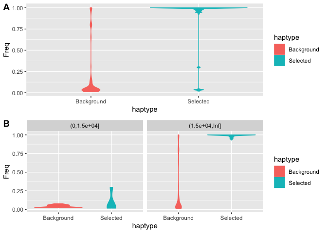

Dating allele emergence using GEVA
================

To investigate the timing of selection in relation to the emergence of
variants at selective sweeps we used
[GEVA](https://github.com/pkalbers/geva) (Albers and McVean 2020)
(Genealogical Estimation of Variant Age) to estimate the age of all 7.7M
variants genome-wide that were present within our sample of phased
haplotypes (see [03.phasing](03.phasing.md)).

One requirement for GEVA is that the ancestral and derived alleles are
identified for each SNP. We used
[est-sfs](http://www.homepages.ed.ac.uk/pkeightl//software) (Keightley
and Jackson 2018) for this task as follows;

First we created a whole-genome alignment of *A. digitifera* with two
outgroup species, *A. millepora* and *A. tenuis* using
[Cactus](https://github.com/ComparativeGenomicsToolkit/cactus) (v2.0.5).
We then exported the alleles at all snps using `halSnps` and filtered
these to only include those overlapping our SNP callset. These were then
used to generate an input file for `est-sfs`.

After running `est-sfs` we used `bcftools` and custom awk scripts to
update our phased variant callset by assigning the ancestral allele
inferred by `est-sfs` to the reference allele. This updating process
takes care to update genotypes in instances where ref and alt alleles
are swapped from their original values. See bash and shell scripts in
[data/hpc/ancestral_allele/](data/hpc/ancestral_allele/) for details.

The phased vcf file with ref updated to the ancestral allele was then
used as input to GEVA. See [data/hpc/geva/](data/hpc/geva/) for details

## Variant consequence calling

We used `bcftools csq` to predict variance consequences for all SNPs
overlapping the haem peroxidase gene `s0150.g24`. Since we are
interested in the consequences of derived alleles we first created a
version of the *A. digitifera* genome in which the bases were altered at
all SNP positions to be that of the ancestral allele.

``` bash
# This uses bcftools to identify ref mismatches in the vcf with aa=ref
bcftools norm -c=w BLFC01000154.1_aaref.vcf.gz -f BLFC01000154.1.fasta 2> ref_mismatches.txt

# This creates a version of the ref with ancestral allele at SNP positions
cat ref_mismatches.txt | awk -f aaref.awk | bioawk -c fastx '{printf(">%s\n%s\n",$name,$seq)}' > BLFC01000154.1_aa.fasta

# Check that the new ref is correct
bcftools norm -c=x BLFC01000154.1_aaref.vcf.gz -f BLFC01000154.1_new.fasta
```

Consequence calling was then done using the vcf and reference sequences
where the AA is encoded as REF.

``` bash
bcftools csq -f BLFC01000154.1_aa.fasta -g s0150.g24.gff BLFC01000154.1_aaref.vcf.gz -O t > s0150.g24.csq.tsv 
```

## Haem Peroxidase locus on BLFC01000154.1

We used results from GEVA in combination with allele frequency and
variant consequence information to investigate variants overlapping
`s0150.g24` in detail. To facilitate this we first used plink2 to
calculate allele frequencies in each population separately.

``` bash
plink2 --vcf BLFC01000154.1_aaref.vcf.gz --allow-extra-chr --freq 'cols=chrom,pos,ref,alt,altfreq'  --pheno populations.txt --loop-cats 'site'
paste plink2.*.afreq | awk '{OFS="\t";print $1,$2,$4,$5,$6,$12,$18}' > BLFC01000154.1_plink2.all.afreq
```

``` bash
gunzip -c BLFC01000154.1_aaref.vcf.gz | grep -v '^#' | awk '{OFS="\t";print $1,$2,$4,$5,$8}' > BLFC01000154.1_aaref_allele_info.tsv
```

A plot of these allele frequencies by population indicates a large
number of high-frequency derived alleles in the inshore population
compared with the two offshore populations. This is expected since the
inshore population was under selection. Interestingly, when we break
this down further we see that low frequency alleles in the inshore
population are far younger than high frequency ones with the switch
occurring between 2000 and 10000 generations ago. This strong dichotomy
between young, rare alleles and old frequent ones is not present in the
reference (offshore) populations. It suggests that most rare alleles in
the inshore population reflect variants that have arisen since the onset
of strong selection at this locus.

<!-- -->

Combining all this information we create the plot below

<!-- -->

There are quite a few missense variants in the inshore copy. We can
export the resulting protein sequence to see if there are any
consequences of this change

``` bash
bcftools view -S selected_indvs.txt BLFC01000154.1_aaref.vcf.gz > BLFC01000154.1_aaref_inshore.vcf
bgzip BLFC01000154.1_aaref_inshore.vcf 
tabix BLFC01000154.1_aaref_inshore.vcf.gz
bcftools consensus  -f BLFC01000154.1_aa.fasta BLFC01000154.1_aaref_inshore.vcf.gz > BLFC01000154.1_inshore_consensus.fasta
```

``` bash
gffread -g BLFC01000154.1_inshore_consensus.fasta -y s0150.g24.protein_inshore.fa s0150.g24.gff
samtools faidx ../annotation/protein.fa adig_s0150.g24.t1 > s0150.g24.protein.fa 
```

<div id="refs" class="references csl-bib-body hanging-indent">

<div id="ref-Albers2020-vl" class="csl-entry">

Albers, Patrick K, and Gil McVean. 2020. “Dating Genomic Variants and
Shared Ancestry in Population-Scale Sequencing Data.” *PLoS Biol.* 18
(1): e3000586.

</div>

<div id="ref-Keightley2018-dh" class="csl-entry">

Keightley, Peter D, and Benjamin C Jackson. 2018. “Inferring the
Probability of the Derived Vs. The Ancestral Allelic State at a
Polymorphic Site.” *Genetics* 209 (3): 897–906.

</div>

</div>
