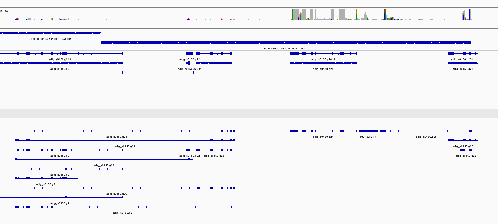

```{r setup, include=FALSE, message=FALSE}
knitr::opts_chunk$set(echo = FALSE,message=FALSE,warning = FALSE)
library(tidyverse)
library(ggpubr)
library(cowplot)
```

To further understand the function of genes under selection we analysed published RNA-seq data from experiments on *Acropora digitifera* in Japan.  Two datasets were identified;

  - [PRJNA309168](https://www.ncbi.nlm.nih.gov/bioproject/309168) The transcriptomic response of the coral Acropora digitifera to a competent Symbiodinium strain: the symbiosome as an arrested early phagosome
  - [PRJDB3244](https://www.ncbi.nlm.nih.gov/bioproject/317857) Acropora digitifera developmental progression. 
  
Raw reads from both these datasets were downloaded using sra-toolkit (see [00_sra.sh](data/hpc/maprna/00_sra.sh)) and mapped to the *Acropora digitifera* genome using [STAR 2.7.10a](https://github.com/alexdobin/STAR) as follows;

```bash
STAR --runThreadN 60 \
	--genomeDir ref \
	--readFilesIn ${sample}_1.fastq ${sample}_2.fastq \
	--outFileNamePrefix ${sample} \
	--outSAMtype BAM Unsorted \
	--outSAMunmapped Within \
	--outSAMattributes Standard \
	--quantMode GeneCounts
```

## Verifying gene structure

Since the selected haplotype at the gene `s0150.g24` involves a potential splice variant we used [StringTie](https://ccb.jhu.edu/software/stringtie/) v2.2.1 to examine potential variation in exon usage at this gene. To do this we first extracted reads on the appropriate scaffold using samtools view and then sorted and merged these to produce a bam that could be viewed in IGV

Potential transcripts were identified and reads assigned to them using StringTie separately for each sample. Then results for all samples were merged as follows;

```bash
for f in *_BLFC01000154.1.bam;do
	sample=${f%_BLFC01000154.1.bam}
	stringtie $f -G ../../genome/adig-v2-ncbinames.gff --conservative -p 60 -A ${sample}_geneab.out -o ${sample}.gtf
done

ls *.gtf > mergelist.txt

stringtie --merge -p 40 -G ../../genome/adig-v2-ncbinames.gff -o BLFC01000154.1_stringtie_merged.gtf mergelist.txt
```

We then used `gffcompare` to compare this with the reference annotation. This was viewed together with read coverage in IGV (see image below).  This shows that the gene at g24 has extremely high expression (though not broken down by sample yet) but there is no evidence for alternative splicing in this gene.  There is evidence however, for an additional exon in the preceeding gene (g25) and that the following genes actually form a complex network of alternately spliced exons rather than being distinct and independent genes. 


```{r}

```


# Gene expression

In an effort to find functional information on this gene we also examined its expression across sample conditions in both these experiments.  This provided little information of value however as expression was extremely low for this gene (counts < 5, many 0's) in the developmental expression experiment.  Although expression was high in the larval infection experiment, and increased over time, is was not different between control and infected treatments.

```{r, results='hide'}
library(tximport)
library(DESeq2)


if ( !file.exists("data/r_essentials/26_txi_genes.rds")){
  gene_counts_files_a <- list.files("data/hpc/maprna/","SRR.*.genes.results", full.names = TRUE) 
  gene_counts_files_b <- list.files("data/hpc/maprna/","D.*.genes.results", full.names = TRUE) 

  names(gene_counts_files_a) <- gene_counts_files_a %>% str_extract("S([^\\.]*)")
  names(gene_counts_files_b) <- gene_counts_files_b %>% str_extract("D([^\\.]*)")

  txi_genes_a <- tximport(gene_counts_files_a, type = "rsem", txIn = FALSE, txOut = FALSE)
  txi_genes_b <- tximport(gene_counts_files_b, type = "rsem", txIn = FALSE, txOut = FALSE)
  write_rds(list(txi_genes_a,txi_genes_b),"data/r_essentials/26_txi_genes.rds")
} else {
  l <- read_rds("data/r_essentials/26_txi_genes.rds")
  txi_genes_a <- l[[1]]
  txi_genes_b <- l[[2]]
}  
  
sample_table_a <- read_csv("data/hpc/maprna/SraRunTable_amin.txt",show_col_types = FALSE) %>% 
  dplyr::select(Run,time_point,infection_status) %>% 
  mutate(infection_status = ifelse(infection_status=="not infected","control","infected")) %>% 
  column_to_rownames("Run") %>% as.data.frame()

sample_table_b <- read_csv("data/hpc/maprna/SraRunTable_rb.txt",show_col_types = FALSE) %>% 
  dplyr::select(Run,condition=sample_name) %>% 
  column_to_rownames("Run") %>% as.data.frame()

all(rownames(sample_table_a) == colnames(txi_genes_a$counts))
all(rownames(sample_table_b) == colnames(txi_genes_b$counts))

txi_genes_a$length[txi_genes_a$length==0] <- 1
dds_a <- DESeqDataSetFromTximport(txi_genes_a,sample_table_a,~time_point*infection_status)
dds_nz_a <- dds_a[rowSums(counts(dds_a)>0)>10,]
vst_a <- varianceStabilizingTransformation(dds_nz_a)

txi_genes_b$length[txi_genes_b$length==0] <- 1
dds_b <- DESeqDataSetFromTximport(txi_genes_b,sample_table_b,~condition)
dds_nz_b <- dds_b[rowSums(counts(dds_b)>0)>6,]
vst_b <- varianceStabilizingTransformation(dds_nz_b)
```


```{r}
genes <- c('adig_s0150.g24')

get_assay <- function(genes,vst,sample_table){
  genes_assay <- assay(vst) %>% 
    as.data.frame() %>% 
    rownames_to_column("gene") %>% 
    filter(gene %in% genes) %>% 
    pivot_longer(-gene, names_to = "Run",values_to = "count") %>% 
    left_join(sample_table %>% rownames_to_column("Run")) 
}

amin_assay <- get_assay(genes,vst_a,sample_table_a)
rb_assay <- get_assay(genes,vst_b,sample_table_b)

amin_assay %>% 
  ggplot(aes(x=time_point,y=count)) + geom_boxplot(aes(color=infection_status)) + geom_point(aes(color=infection_status))
```


