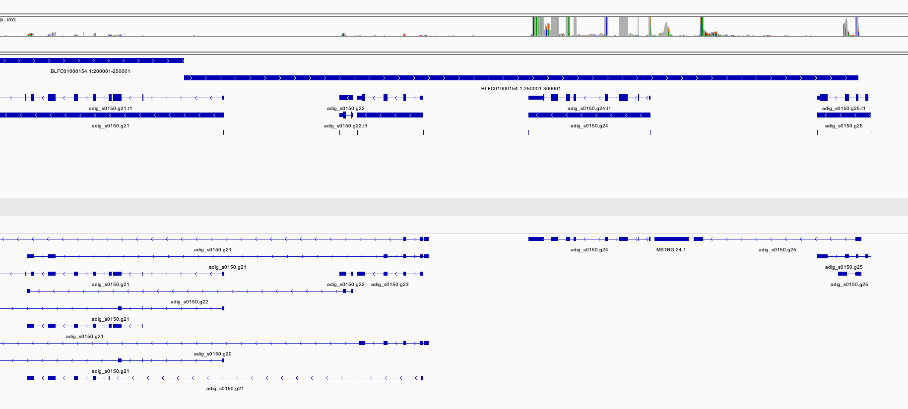

Gene expression analysis for selected loci
================

To further understand the function of genes under selection we analysed
published RNA-seq data from experiments on *Acropora digitifera* in
Japan. Two datasets were identified;

-   [PRJNA309168](https://www.ncbi.nlm.nih.gov/bioproject/309168) The
    transcriptomic response of the coral Acropora digitifera to a
    competent Symbiodinium strain: the symbiosome as an arrested early
    phagosome
-   [PRJDB3244](https://www.ncbi.nlm.nih.gov/bioproject/317857) Acropora
    digitifera developmental progression.

Raw reads from both these datasets were downloaded using sra-toolkit
(see [00\_sra.sh](data/hpc/maprna/00_sra.sh)) and mapped to the
*Acropora digitifera* genome using [STAR
2.7.10a](https://github.com/alexdobin/STAR) as follows;

``` bash
STAR --runThreadN 60 \
    --genomeDir ref \
    --readFilesIn ${sample}_1.fastq ${sample}_2.fastq \
    --outFileNamePrefix ${sample} \
    --outSAMtype BAM Unsorted \
    --outSAMunmapped Within \
    --outSAMattributes Standard \
    --quantMode GeneCounts
```

## Verifying gene structure

Since the selected haplotype at the gene `s0150.g24` involves a
potential splice variant we used
[StringTie](https://ccb.jhu.edu/software/stringtie/) v2.2.1 to examine
potential variation in exon usage at this gene. To do this we first
extracted reads on the appropriate scaffold using samtools view and then
sorted and merged these to produce a bam that could be viewed in IGV

Potential transcripts were identified and reads assigned to them using
StringTie separately for each sample. Then results for all samples were
merged as follows;

``` bash
for f in *_BLFC01000154.1.bam;do
    sample=${f%_BLFC01000154.1.bam}
    stringtie $f -G ../../genome/adig-v2-ncbinames.gff --conservative -p 60 -A ${sample}_geneab.out -o ${sample}.gtf
done

ls *.gtf > mergelist.txt

stringtie --merge -p 40 -G ../../genome/adig-v2-ncbinames.gff -o BLFC01000154.1_stringtie_merged.gtf mergelist.txt
```

We then used `gffcompare` to compare this with the reference annotation.
This was viewed together with read coverage in IGV (see image below).
This shows that the gene at g24 has extremely high expression (though
not broken down by sample yet) but there is no evidence for alternative
splicing in this gene. There is evidence however, for an additional exon
in the preceeding gene (g25) and that the following genes actually form
a complex network of alternately spliced exons rather than being
distinct and independent genes.



# Gene expression

In an effort to find functional information on this gene we also
examined its expression across sample conditions in both these
experiments. This provided little information of value however as
expression was extremely low for this gene (counts < 5, many 0’s) in
the developmental expression experiment. Although expression was high in
the larval infection experiment, and increased over time, is was not
different between control and infected treatments.

<!-- -->
