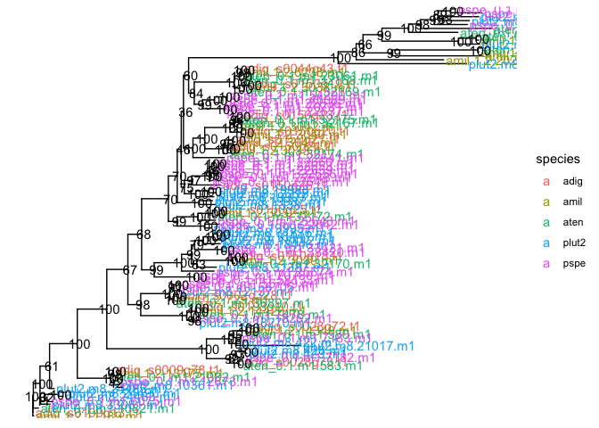
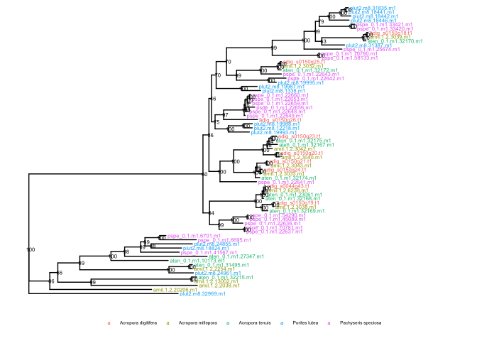

Phylogenetic analysis of haem peroxidases
================

We identified haem peroxidases from within *Acropora digitifera* as all
proteins annotated with Interproscan domain `IPR019791`. These were then
used as a query set to identify haem peroxidases in other coral species
using BLASTP as follows;

``` bash
# Example for Acropora millepora (amil)
blastp -db other_species/amil_1.1.maker_006.proteins.fasta -query pxproteins.fasta -max_target_seqs 5 -outfmt 6 -evalue 1e-10 | awk '{print $2}' | sort -u | xargs -I{} samtools faidx other_species/amil_1.1.maker_006.proteins.fasta {} > amil.fasta
```

This produced a total of 105 sequences (including Acropora digitifera
proteins) that we aligned using the MAFFT plugin in Geneious. We then
masked positions with less than 50% aligned bases to produce a final
alignment with length 679.

IQ-Tree was then used to perform model finding and tree inference as
follows;

``` bash
iqtree -s px_align.fasta -B 1000
```

<!-- --><!-- -->
