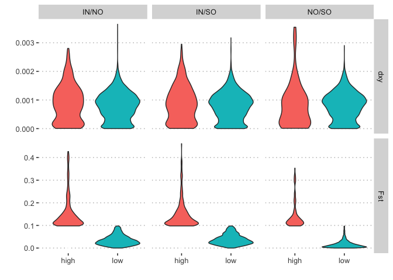

Comparison of Fst and dxy
================

With the development of whole genome or genome-wide marker sequencing a
suite of studies have identified so called “islands of speciation” or
“islands of differentiation” (Turner, Hahn, and Nuzhdin 2005), (Turner
et al. 2010). These genomic islands are especially interesting because
the provide a potential explanation for the widespread observation of
sympatric or parapatric speciation. Later reanalysis however revealed
that many instances where such islands had been observed probably
correspond to regions of low diversity not low gene flow (Cruickshank
and Hahn 2014).

Here, we adopt the suggested methodology of (Cruickshank and Hahn 2014),
and implemented in (Malinsky et al. 2015) to check for islands of
differentiation. The central idea is that two statistics are required,
Fst, which measures relative levels of divergence and which is typically
associated with putative barrier loci, and dxy which measures absolute
levels of divergence. In genuine instances of heterogenous gene flow
extreme values of Fst should also be associated with extreme values of
dxy.

To implement this check we used the PopGenome package to calculate Fst
and dxy across the genome in windows of 50kb with a window jump size of
10kb. We then classified windows into two categories, “high” (top 5%
based on Fst) and “low” (bottom 95%). In theory the “high” category
should include the majority of putative barrier loci and should
therefore be associated with high dxy. As can be seen in the plot below
this is not the case.

<!-- -->

Cruickshank, Tami E, and Matthew W Hahn. 2014. “Reanalysis Suggests That
Genomic Islands of Speciation Are Due to Reduced Diversity, Not Reduced
Gene Flow.” *Mol. Ecol.* 23 (13): 3133–57.

Malinsky, Milan, Richard J Challis, Alexandra M Tyers, Stephan
Schiffels, Yohey Terai, Benjamin P Ngatunga, Eric A Miska, Richard
Durbin, Martin J Genner, and George F Turner. 2015. “Genomic Islands of
Speciation Separate Cichlid Ecomorphs in an East African Crater Lake.”
*Science* 350 (6267): 1493–98.

Turner, Thomas L, Elizabeth C Bourne, Eric J Von Wettberg, Tina T Hu,
and Sergey V Nuzhdin. 2010. “Population Resequencing Reveals Local
Adaptation of Arabidopsis Lyrata to Serpentine Soils.” *Nat. Genet.* 42
(3): 260–63.

Turner, Thomas L, Matthew W Hahn, and Sergey V Nuzhdin. 2005. “Genomic
Islands of Speciation in Anopheles Gambiae.” *PLoS Biol.* 3 (9): e285.

