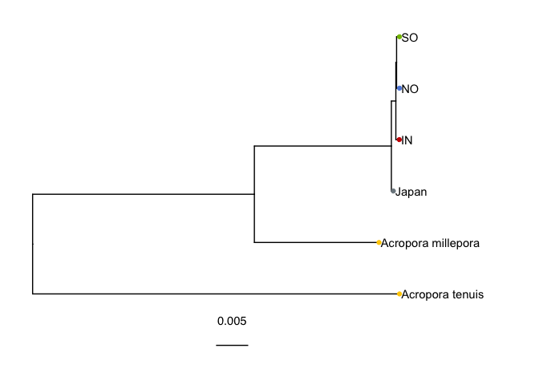

Polymorphism aware phylogenetic analysis with IQ-Tree
================

As an additional check to ensure that we identified the correct
phylogenetic relationships between the three WA reefs and Japan we
analysed genome-wide SNPs with the polymorphism-aware models in IQ-Tree.

First we used ANGSD to calculate allele frequencies at all putatively
neutral sites from our set of high quality SNPs. One advantage of using
PoMo models in IQ-tree over our SFS-based analysis with fastsimcoal2 and
PCA analysis with pcangsd is that they are robust to the choice of
sites. We therefore aggressively filtered sites, removing those with
minor allele frequency less than 0.15. This threshold was chosen to
ensure that the lowest acceptable allele count was 2 (in the smallest
pop; Japan).

<!-- -->
