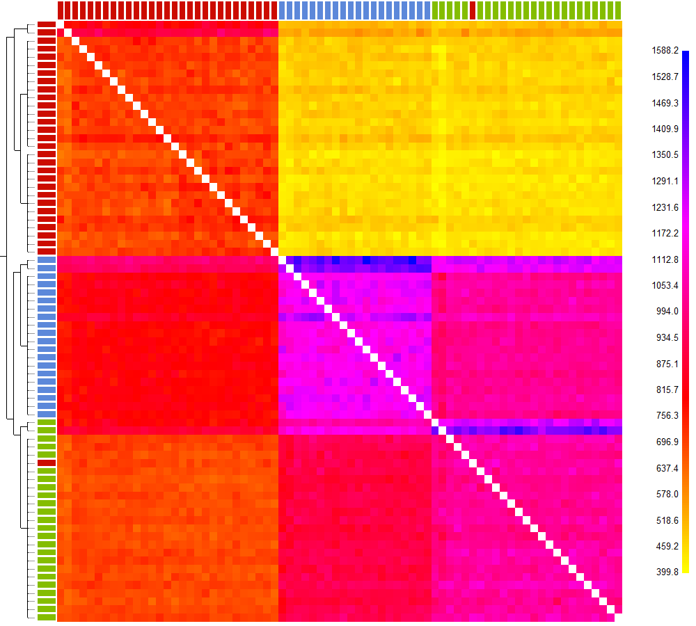

```{r setup, include=FALSE}
knitr::opts_chunk$set(echo = TRUE)
```

With phased vcf file, we performed chrmopainter and finestructure msmc and tree inferences.

The phased haps format files from shapeit were converted into chromopainter format with `impute2chromopainter.pl` per scaffold. To use linked mode, we generated uniform recombination rate map files using `makeuniformrecfile.pl`.

In chromopainter EM parameter estimate, we used 30% of samples (20) and estimated Ne and mu were used to run chromopainter. Next, fineStructure was run with 2000000 iterations of which half was assigned to burn in iteration and half to sampling iteration and -z 1000 as default. The sample relationship tree was built in step4 with 100,000 iterations.

```bash
fs adigitifera.cp -n -phasefiles phase_files/*.phase -recom/* \
-idfile samples.id -hpc 1 -s1indfrac 0.3 -s3iters 2000000 -go
cat adigitifera/commandfiles/commandfile1.txt | parallel -j 20

fs adigitifera.cp -go
cat adigitifera/commandfiles/commandfile2.txt | parallel -j 20

fs adigitifera.cp -go
cat adigitifera/commandfiles/commandfile3.txt | parallel -j 2

fs adigitifera.cp -go
cat adigitifera/commandfiles/commandfile4.txt | parallel -j 2

fs adigitifera.cp -go
fs fs -X -Y -e X2 adigitifera_linked.chunkcounts.out adigitifera_linked_tree.xml \
adigitifera_linked.mapstate.csv
fs fs -X -Y -e X2 adigitifera_linked.chunkcounts.out adigitifera_linked_mcmc.xml \
adigitifera_linked.meancoincidence.csv
```


**Figure:** Co-ancestry matrix with the tree showing inferred relationships between samples.

