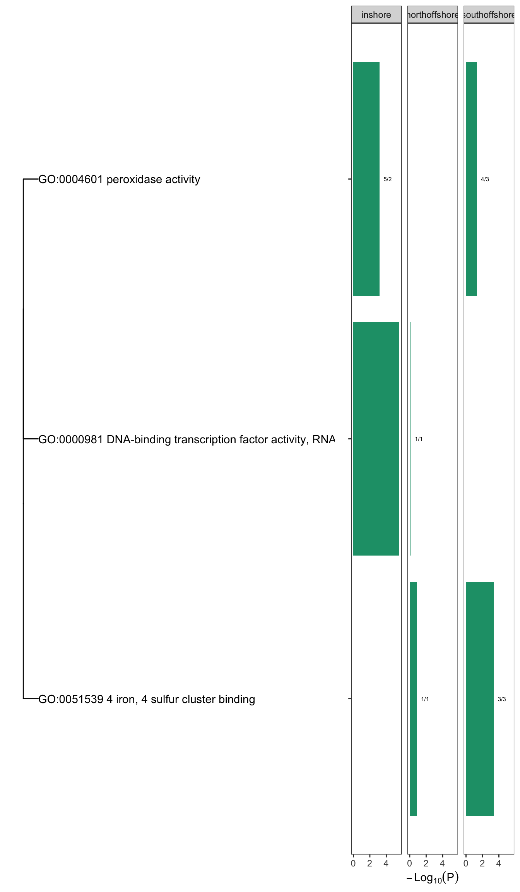

Alternative Gene Ontology Enrichment analysis using Interproscan GO
terms
================

In a previous analysis (see
[10.identify\_selective\_genomic\_windows](10.identify_selective_genomic_windows.md)
we identified a total of 231 candidate selective sweep regions. A
summary of sweep regions and the number of genes covered by them in each
population is shown below;

We then used `topGO` to identify GO terms that were enriched in the gene
sets covered by selective sweeps in each population. In all cases
enrichment was calculated by considering the target set as the set of
all genes intersecting with selective sweeps in a given population, and
the background set was taken as the complete set of annotated genes for
*A. digitifera*.

We found a total of 12 GO terms enriched (p&lt;0.001) across all three
of the locations. These are summarised in Figure 2.

