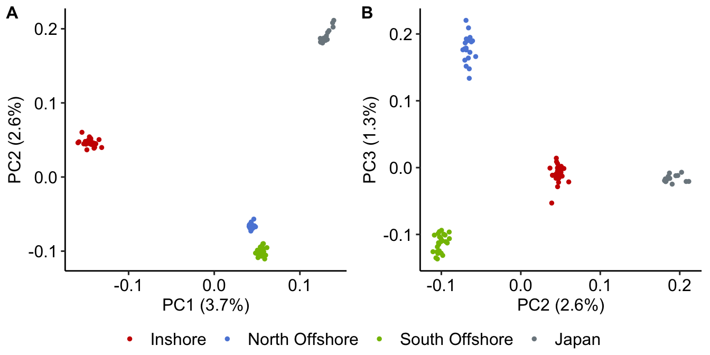

Placing Western Australian Acropora digitifera in context
================

To understand the relationship between *A. digitifera* from WA and a
population in Japan we combined our data with publicly available data
from (Shinzato et al. 2015). This combined dataset included all of our
samples as well as 16 samples from the Ryukyu Islands in Japan, randomly
chosen from the Shinzato et al dataset. Note that the Ryukyu Islands is
also the region of origin for the A. digitifera reference genome.
Japanese samples were downloaded from NCBI and subjected to the same
read quality checks and alignment process as we applied for our own
samples. The resulting bam files had variable coverage (9x - 32x) but
were generally lower coverage than our samples. This difference as well
as other potential differences due to sequencing platform could
introduce biases in our results due to variable call rates for different
types of genotypes. To minimise the effects we performed this analysis
using a genotype likelihood framework (ANGSD) rather than the
hard-called genotype method used for most of our other analyses.

### SNP selection and genotype likelihood calculation

As a precursor to running PCAngsd (see below) we first called SNPs,
filtered sites for quality and calculated genotype likelihoods using
angsd (v 0.933) with the command.

``` bash
angsd -b all_bam.txt -out all -GL 2 -nThreads 8 -doGlf 2 -SNP_pval 1e-6 -doMajorMinor 1 -doMaf 2 -doCounts 1 -minMaf 0.05 -minInd 82 -minMapQ 20 -minQ 20 -setMinDepth 910 -setMaxDepth 3000 -setMinDepthInd 3
```

The options used in this command were chosen to mimic GATK genotype
calling and SNP filtering in our main analysis as closely as possible.
Specifically, `-GL 2` uses a GATK-like genotype likelihood calculation,
`-minInd 82` selects only sites with data for at least 90% of
individuals.

### PCAngsd

We then used PCAngsd version 1.0 obtained from [github commit
cd7feb5a8a76946acde8beaceb919e59dc8d0298](https://github.com/Rosemeis/pcangsd.git)
to perform a PCA analysis. Note that PCAngsd is designed to handle
datasets with differing sequencing depths as is the case here.

``` bash
pcangsd.py -beagle all.beagle.gz -selection -snp_weights -pcadapt -admix -tree -maf_save -pi_save -dosage_save -sites_save -threads 32 -out jpwa
```

Using the resulting covariance matrix we visualise population structure
using a PCA as follows



**Figure 1:** PCA showing population structure for Japanese and Western
Australian A. digitifera samples.

The PCA clearly shows that WA offshore populations are more similar to
each other than to the other samples. The plot also suggests that WA
inshore samples are intermediate between WA offshore and Japanese
samples.

### Phylogenetic Analysis based on UCE and Exon capture probesets

While the analysis above provides information on relative
differentiation between populations of A. digitifera it is useful to
consider the distances between these populations in the context of
broader phylogenetic differences between species within the Acroporidae.
To do this we make use of methodology developed by (Cowman et al. 2020)
to examine phylogenetic relationships based on UCE and Exon sequences.
Steps in this process include;

1.  [Map](data/hpc/iqtree/02_map_probes.sh) the hexa-v2 probeset to
    genomes of all species (A. digitifera, A. millepora and A. tenuis)
    and filter mapping using samclip.
2.  [Create a bed](data/hpc/iqtree/03_sam2bed.sh) file representing an
    approximately 1000bp region around each mapped probe
3.  [Merge overlapping regions](data/hpc/iqtree/04_extract_bams.sh)
    resulting from closely spaced probes and extract these from bams (in
    the case of A. digitifera)
4.  [Call consensus sequences](data/hpc/iqtree/05_call_consensus.sh)
    from bamfiles
5.  [Extract fasta files](data/hpc/iqtree/06_extract_uces.sh)
    corresponding to merged regions
6.  [Gather and align homologous
    sequences](data/hpc/iqtree/07_gather_uces.sh)
7.  [Create a partition file for phylogenomic
    analysis](data/hpc/iqtree/08_make_partitions.sh)
8.  [Run iqtree to find the best models and generate a
    tree](data/hpc/iqtree/09_iqtree.sh)

The resulting tree (rooted at Acropora tenuis) recovers the expected
relative divergences between species (Aten vs Amil &gt; Amil vs Adi).
These divergences (Adi vs Amil \~ 25Mya) are clearly much larger than
between population samples of Acropora digitifera, which agrees with our
assessment that these are recently diverged. Notably, samples from
Japan, Inshore and Offshore locations do not follow the population
structure observed in PCA-based methods which may reflect poor
resolution of UCEs at this level.


**Figure 2:** Phylogenetic tree based on 1023 UCE and 658 Exon loci from
the Hexa-v2 probeset. Tree is a consensus tree generated by iqtree based
on a partitioned analysis in which each locus was allowed a different
model.

### Mitochondrial genotyping

In addition to the PCAngsd and UCE analyses above we created a haplotype
network based on the mitochondrial genomes of all host samples. To
support this we obtained mitochondrial sequences for individual low
coverage samples as follows;

-   All reads (except duplicates) for each sample were mapped to the *A.
    digitifera* mitochondrial reference sequence (NC\_022830.1) using
    bwa mem (version 0.7.17). This produced a small bam file containing
    only mito reads for each sample. See the script
    [02\_map\_reads.sh](data/hpc/mito_mapping/02_map_reads.sh) for the
    exact commands used.  
-   Mitochondrial reads were then used to call variants against the
    reference sequence using samtools mpileup (version 1.7), followed by
    bcftools (version 1.9) to call a consensus sequence for the sample.
    (See script
    [03\_call\_consensus.sh](data/hpc/mito_mapping/03_call_consensus.sh))
-   Since consensus sequences were all the same length no alignment was
    necessary and they were simply concatenated to produce an alignment.
-   This set of aligned mitochondrial sequences was used as a set of
    haplotypes for network visualisation with
    [PopArt](http://popart.otago.ac.nz/index.shtml)

The resulting haplotype network is shown below. Note how the vast
majority of samples share a haplotype and how those haplotypes that
differ are (a) spread among locations and (b) mostly attributable to a
single mutation from the common haplotype.


<div id="refs" class="references csl-bib-body hanging-indent">

<div id="ref-Cowman2020-mo" class="csl-entry">

Cowman, Peter F, Andrea M Quattrini, Tom C L Bridge, Gregory J
Watkins-Colwell, Nur Fadli, Mila Grinblat, T Edward Roberts, Catherine S
McFadden, David J Miller, and Andrew H Baird. 2020. “An Enhanced
Target-Enrichment Bait Set for Hexacorallia Provides Phylogenomic
Resolution of the Staghorn Corals (Acroporidae) and Close Relatives.”
*Mol. Phylogenet. Evol.* 153 (December): 106944.

</div>

<div id="ref-Shinzato2015-rz" class="csl-entry">

Shinzato, Chuya, Sutada Mungpakdee, Nana Arakaki, and Noriyuki Satoh.
2015. “Genome-Wide SNP Analysis Explains Coral Diversity and Recovery in
the Ryukyu Archipelago.” *Sci. Rep.* 5 (December): 18211.

</div>

</div>
