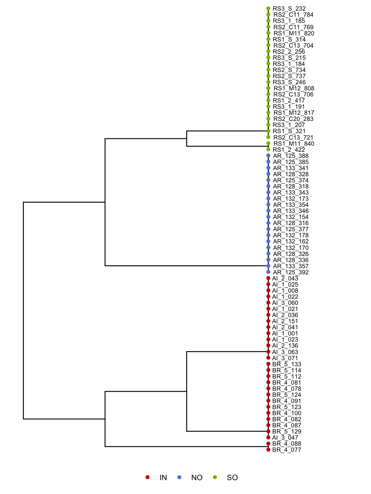

Haplotype-based population structure with fineStructure
================

We used
[fineStructure](https://people.maths.bris.ac.uk/~madjl/finestructure/finestructure_info.html)
to look for fine-scale patterns of population structure based on our
phased genotype data.

For this analysis we used the phased haps format files from shapeit.
These were converted into chromopainter format with
`impute2chromopainter.pl` per scaffold. To use linked mode, we generated
uniform recombination rate map files using `makeuniformrecfile.pl`.
These steps are captured in the snakemake script
[0.prepare\_chromopainter.smk](data/hpc/fineStructure/0.prepare_chromopainter.smk)

In the chromopainter EM parameter estimation step we used 30% of samples
(20). Next, fineStructure was run with 2000000 iterations of which half
were assigned to burn in iteration and half to sampling iteration. These
steps are captured in
[1.fs\_computation.sh](data/hpc/fineStructure/1.fs_computation.sh)

This process produces a finestructure tree xml file which we parsed
using the R code provided as part of the fineStructure program to
produce a standard `phylo` object. This was then plotted using ggtree to
produce the finestructure tree shown below.

All nodes in this tree had bootstrap support of 0.99 or better. The tree
clearly distinguishes our three locations as distinct clades, but also
identifies some structure within these clades. Two small clades
(RS1\_M11\_840, RS1-2\_422) and (BR-4-088, BR-4-077) were identified
which contained samples with relatively low sequencing depth and
presumably reflect small biases due to genotyping error that
fineStructure is able to identify as structure. Within the inshore
samples however there did seem to be a genuine split between the two
inshore locations AI (Adele Island) and BR (Beagle Reef).

Although this split was clearly evident from the fineStructure tree it
was not evident in PCA analyses (smartpca, PCAngsd), nor was it visible
in patterns of IBD sharing. Since these differences between AI and BR
were evidently small relative to the differences between major
geographically defined populations (IN, NO, SO) we chose to ignore them
for our other analyses.
