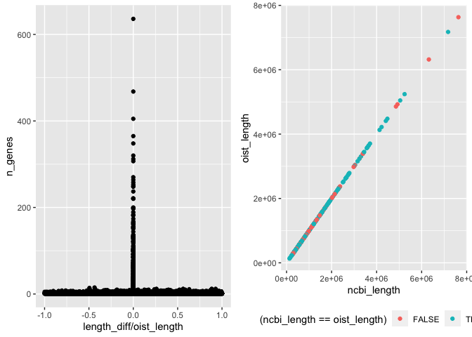

LiftOver of annotations to NCBI Genome Build
================

All of our read mapping, variant calling and subsequent population
genetics was performed on the *A. digitifera* version 2.0 genome
available through RefSeq (`GCA_014634065`). Unfortunately there are no
gene models available for this genome yet. Although there are gene
models available for the original v2.0 reference available from the
[OIST marine genomics
unit](https://marinegenomics.oist.jp/adig/viewer/info?project_id=87)
this version of the reference differs slightly from the RefSeq version,
presumably due to modifications made as part of the RefSeq QC process.

These differences can be seen by comparing the lengths of RefSeq and
OIST contigs.

We see that contigs that are similar in length share alot of genes
indicating that they are likely to be homologous. Filtering to include
only those contigs with very similar lengths, and that share at least 10
genes we obtain a list of 265 contigs highly likely to be correct
matches and that comprise around 380Mb of the 415Mb genome.

<!-- -->

Unfortunately we can see that simply matching based on contig length is
not enough as many large contigs differ, even if only by a small amount
(\~10bp). To address this issue and allow us to use the OIST annotations
in our work on the RefSeq genome we performed a `liftOver` process to
transfer these OIST annotations onto the RefSeq assembly.

First we performed a whole genome alignment of the RefSeq and OIST
genomes with
[Cactus](https://github.com/ComparativeGenomicsToolkit/cactus), while
also using the chromosome-level *Acropora millepora* genome as a
reference.

``` bash
singularity run -B $(pwd):/data cactus_v2.0.5.sif cactus /data/jobstore /data/seqfile_amil.txt /data/adig.hal
```

As the liftOver utilities operate on files in `bed` format we first
converted the annotations from gff to bed using an `awk` script

``` bash
cat dl/adig.gff | awk -f gff2bed.awk > oist_full.bed
```

Next we followed directions provided
[here](https://github.com/ComparativeGenomicsToolkit/hal/blob/chaining-doc/doc/chaining-mapping.md)
and
[here](http://genomewiki.ucsc.edu/index.php/Minimal_Steps_For_LiftOver)
to create a ucsc chain file to support the liftOver process. All the
steps in this process are captured in
[03\_liftover.sh](data/genome/03_liftover.sh).

Using this chain file and the ucsc liftOver utility we converted
coordinates from our oist bed to an ncbi version. This resulted in
successful conversion of most genes but 2554 were discarded because they
(or their child objects) could not be properly mapped to the new build.

We then filtered these to include only those conversions corresponding
to oist-ncbi pairs of chromosomes that could be confidently identified
(see above) and converted these annotations from BED format back to gff

The final resulting `gff` file (called `adig-v2-ncbi.gff`) contained
`18993` genes compared with `22327` in the original.
