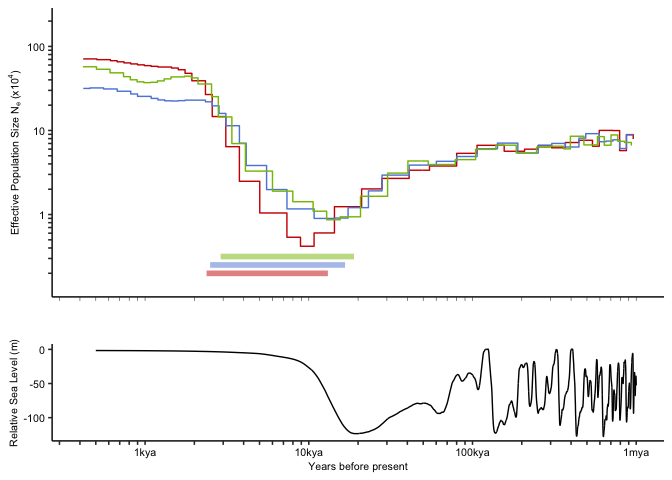

Demographic History with SMC++
================

This rmarkdown document is primarily concerned with producing a single
plot for publication.

TODO: Merge this with the main demographic history Rmd document.

    ## `summarise()` has grouped output by 'label', 'mu'. You can override using the `.groups` argument.

    ## Rows: 30001 Columns: 10

    ## ── Column specification ────────────────────────────────────────────────────────
    ## Delimiter: "\t"
    ## dbl (9): Time, Iso_tot, Iso_ice, Iso_do, Tsurf, Tdo, Ice_eas, Ice_nam, Ice_tot
    ## lgl (1): X

    ## 
    ## ℹ Use `spec()` to retrieve the full column specification for this data.
    ## ℹ Specify the column types or set `show_col_types = FALSE` to quiet this message.

    ## Warning: Removed 51 row(s) containing missing values (geom_path).

    ## Warning: Removed 20004 row(s) containing missing values (geom_path).

<!-- -->
